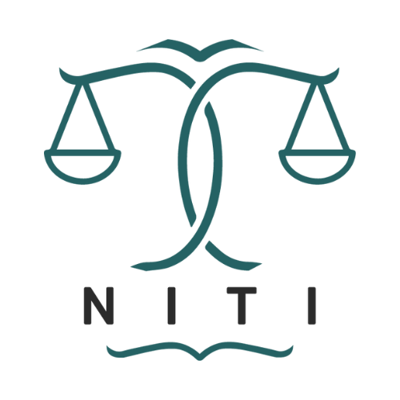

# Niti

Lawyers have to spend a lot of time searching legal documents every day. Law students and CA students also spend a lot of time going through multiple legal documents to find a specific answer. To ease this process, we have come up with this idea of Niti. Our aim is to help them search through legal information quickly so that they have more time for legal analysis, strategy development, and decision making. This will also be helpful for the general public to get easier access to legal information.

One can ask legal queries, our system will search for your answers through the legal documents, extract the answer as it is, and reply back to the user, also providing the link to the document where the law resides.

For the initial phase, we have included the following legal documents:

1. [Constitution of Nepal](https://lawcommission.gov.np/en/wp-content/uploads/2021/01/Constitution-of-Nepal.pdf)
2. [The National Civil (Code) Act, 2017 (2074)](https://www.moljpa.gov.np/en/wp-content/uploads/2018/12/Civil-code.pdf)
3. [The National Civil Procedure (Code) Act, 2017](https://www.moljpa.gov.np/en/wp-content/uploads/2018/12/Civil-procedure-code.pdf)

### Getting Started

- Clone the repository: `git clone https://github.com/your-username/niti.git`
- Navigate to the niti-client folder: `cd niti-client`
- Install dependencies: `npm install`
- Run the application: `npm start`

### Feedback and Support

_For feedback, issues, or support, please open an issue._
